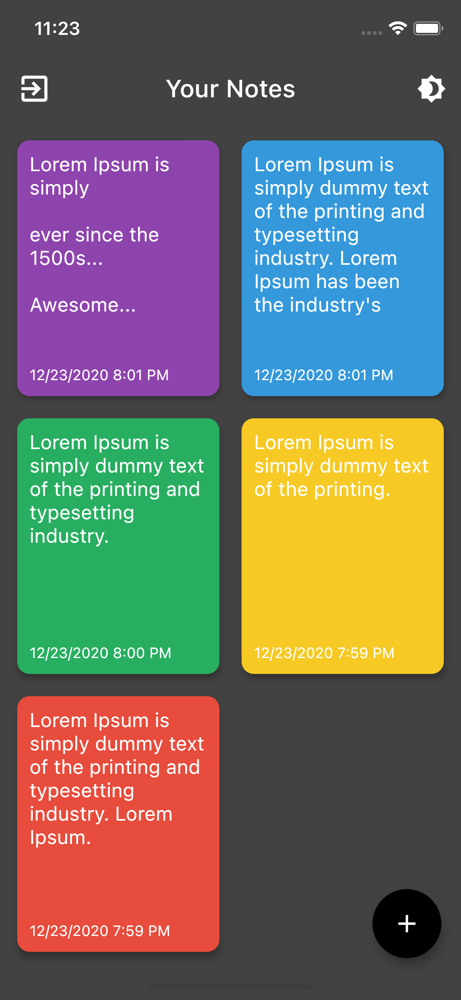
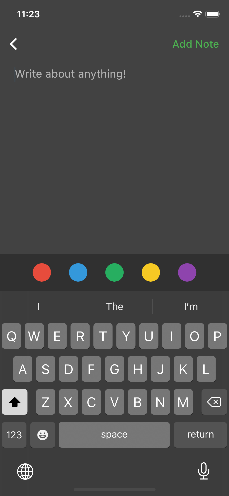
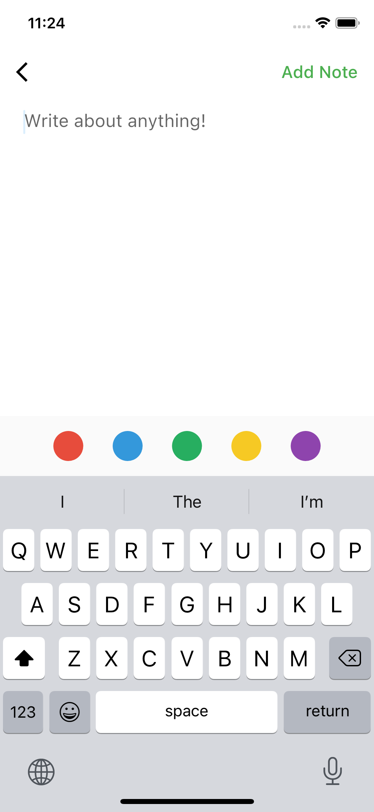

# Your notes

Simple flutter notes application with firebase and BLOC pattern. Nice demonstration how state managment with bloc, Streams and Futures works in flutter. Provided Dark and Light theme with switcher. 

## Dark mode

Notes list        |  Add note
:-------------------------:|:-------------------------:
 |  

## Light mode

Notes list        |  Add note
:-------------------------:|:-------------------------:
|  

